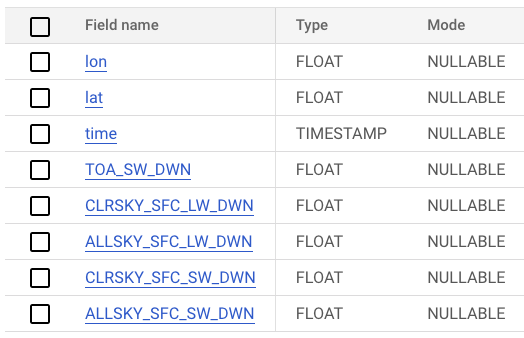
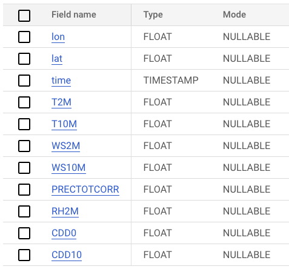

# NASA POWER data pipeline

This is a data engineering project that uses the [NASA POWER](https://power.larc.nasa.gov/) data to showcase the extraction, processing and visualization of large amounts of geospatial data using google cloud technologies.

## Project description

The NASA Power project (prediction of worldwide energy resources) provides access to free data intended for supporting the research and development of renewable energies, building energy efficiency, and agricultural needs.

My objective is to extract the NASA power data on a daily basis with an automated pipeline, upload the raw data to a data lake and together with data for several city locations, create visualizations to gain insights into climate trends and solar radiation in a specific area of interest. The parameters chosen from the POWER data include temperature, wind speed, precipitations and solar radiation. For specific details about the meteorological and radiation parameters check [this link](https://gist.github.com/abelcallejo/d68e70f43ffa1c8c9f6b5e93010704b8).

The dashboard provides the following visualizations:

- Time series charts showing the variations of several climate and solar irradiance parameters for a selected region in a selected time frame.
- A bar chart visualization of the top months by precipitations, temperature or solar radiation in a specific region.
- A pivot table that shows time trends of a specific parameter and a selected group of cities. Useful for comparing the trends between different regions.

Such visualizations can aid in decision-making processes related to renewable energy and sustainable building development.

## Technology Stack

I make use of the following technologies:

- Google Cloud Storage as the datalake to store the raw dataset.
- Google BigQuery as the data warehouse.
- Terraform to create google cloud storage buckets and BigQuery datasets.
- Dbt core as the transformation tool for data modeling.
- Self-hosted Prefect core to manage and monitor the workflow.
- Looker as the dashboard for end-user for visualization
- Makefile
- Poetry for managing python dependencies

## Data Pipeline Architecture and workflow

 
 

  

### Nasa Power Data

The Nasa Power data is stored in s3 and can be accessed [https://power.larc.nasa.gov/data/](here).

### Data Orchestration with Prefect flows

Prefect is used for data orchestrations and consist of multiple flows and deployments:

- Web to GCS Flow:

    Each execution downloads both solar irradiance and meteorological data from s3 for a speficic day and upload it into google cloud storage. The structure of the data saved in the bucket is as follows:

            flux_data:
                - year
                    - month
                        - day1
                        - day2
                        ...
            geos_data:
                - year
                    - month
                        - day1
                        - day2
                        ...

- GCS to BigQuery Flow:

    It downloads data from GCS for a specific date. Once loaded, the data is transformed. The transformation consist of selecting the parameters of interest from the parquet data and creating a new dt column computed by truncating the timestamp to a monthly frequency. This last step is useful when executing queries that require referencing the monthly part of the timestamp as the data in bigquery is partitioned by month.

    After the flow transforms the data, a following task is to update the BigQuery table with the new data for the currentling executing timestamp.

- Initialize BigQuery tables Flow:

    It creates two partitioned tables: `flux_table_partitioned` to store solar irradiance related metrics and `geos_table_partitioned` to store meteorological related data. 

- Upload cities table Flow

    It simply uploads the city table to BigQuery. Only need to be executed once.

I included default deployments for each of the flows. They can be easily applied using the [Makefile](./Makefile). Check the replication steps for more information.

### Dbt

Dbt is used for the modelling part. The data is read from bigQuery and different models are created. 

### Data visualization

Looker is used for the visualizations. It uses the data models in bigQuery created by a dbt Job.

## Data sources and Data modelling

The NASA Power data is consists of several [sources](https://power.larc.nasa.gov/docs/methodology/data/sources/). For this project, I have selected two different sources of data:

1. Fast Longwave and Shortwave Flux (FLASHFlux): Provides solar irradiance data. The source of the flux data is the CERES project. It stands for `Clouds and Earth’s Radiant Energy System`. It uses measurements from satellites along with data from many other instruments to produce a comprehensive set of data products for climate, weather and applied science research. I have selected the fux data source that is updated more frequently (< 5 days from measurement) so the pipeline can be programmed to read data in a similar period of time. 

    The FLUX parameters selected are:

        - TOA_SW_DWN: Total solar irradiance on top of atmosphere. Shortwave downward.
        - CLRSKY_SFC_LW_DWN:  Termal infrarred irradiance under clear sky conditions. Longwave downward.
        - ALLSKY_SFC_LW_DWN: Termal infrarred irradiance under all sky conditions. Longwave downward.
        - CLRSKY_SFC_SW_DWN: Termal infrarred irradiance under clear sky conditions. Shortwave downward.
        - ALLSKY_SFC_SW_DWN: Termal infrarred irradiance under all sky conditions. Shortwave downward.

2. NASA's Goddard Earth Observing System (GEOS): Provides meteorological data. Types of observations include land surface observations of surface pressure, ocean surface observations of sea level pressure and winds, sea level winds inferred from backscatter returns from space-borne radars, conventional upper-air data from rawinsondes (e.g., height, temperature, wind and moisture), and (6) remotely sensed information from satellites. The data is updated in S3 with a daily frequency.

    The GEOS parameters selected are:

        - T2M_CELCIUS:  Temperature at 2 meters in Celcius degrees.
        - T10M_CELCIUS: Temperature at 10 meters in Celcius degrees.
        - WS2M: Windspeed at 2 meters.
        - WS10M: Windspeed at 10 meters.
        - PRECTOTCORR:  Average of total precipitation at the surface of the earth in water mass.
        - RH2M: Relative Humidity at 2 Meters.
        - CDD0: Cooling Degree Days Above 0 C.
        - CDD10: Cooling Degree Days Above 10 C.

I extract each of the these parameters measured on a daily basis. The measurements of the flux data are provided for each date on a 1° x 1° latitude/longitude grid whereas the meteorological data are provided on a ½° x ⅝° latitude/longitude grid. The resulting schemas in BigQuery are:

Flux schema:

Geos schema:

### Partitions

Both raw tables are partitioned by the time column truncated by month [See creation query](./flows/queries/flux_table_creation.sql). In this way, common operations such as groping or filtering by a specific datetime are optimized. This has an important impact in the models calculated subsequently with dbt specially when computing the monthyl average of some parameters

### Dbt modelling

Instead of querying and visualizing of all datapoints in the global grid, it is more practical to limit the datapoints that are close to a city or region of interest. In order to achieve this, I added a new table for `cities`. It contains information about all cities of the world with their coordinates. As it is a samall file, I include it as a csv in this repo and can be accessed [here](./worldcities.csv).

In dbt, given the cities table, the raw flux and geos tables I perform an inner [spatial join](./dbt_nasa_power/models/staging/city_flux_model.sql) with the flux and geos tables separately to create two new tables which contain data from the cities joint with solar irradiance and meteorological measurements. The resulting models are a time series for each city and a set of metrics.  

## Dashboard preview

## Replication steps

### Setup google cloud

1. Start by creating a new Google Cloud account and setting up a new project. 

2. Create a new service account and grant it Compute Admin, Service Account User, Storage Admin, Storage Object Admin, and BigQuery Admin roles. 

3. After creating the service account, click on "Manage Keys" under actions Menu. Click on the Add Key dropdown and click on Create new key and create a new key in JSON format, saving it to your computer.

4. Install the Google Cloud CLI and log in by running "gcloud init" in an Ubuntu Linux environment or similar. 

5. Choose the cloud project you created to use. Set the environment variable to point to your downloaded service account keys JSON file by running "export GOOGLE_APPLICATION_CREDENTIALS=<path/to/your/service-account-authkeys>.json". 

6. Refresh your token/session and verify authentication by running "gcloud auth application-default login". 

7. Ensure that the following APIs are enabled for your project: 

https://console.cloud.google.com/apis/library/iam.googleapis.com 
https://console.cloud.google.com/apis/library/iamcredentials.googleapis.com 
https://console.cloud.google.com/apis/library/compute.googleapis.com

### Setup Environmet VM on Google Cloud (Optional)

Note that workflow execution environment can be setup in your local machine but for the purpose of having a common configuration you can create a VM on Google Cloud and follow the next steps:

1. Before we can interact with any VM on Google cloud we need to create an ssh key. The steps are described [here](https://cloud.google.com/compute/docs/connect/create-ssh-keys).

2. Once the private and public key pair is generated, we need to add the public key to our Google cloud comnpute engine configuration. On the GC console, navigate to compute engine -> metadata -> SSH Keys -> Add SSH Keys. 

You can copy your generated key as:

        cat ~/.ssh/gcp.pub | pbcopy

3. Create an VM instance with the following minmum specifications: 4 vCPUs and 16GB RAM and a boot disk of minimum 30GB. For operating system choose a recent stable Ubuntu release. Alternatively you can also use the following gcp command to create a vm instance.

4. Ssh to the created instance. This can be done with the ssh command or using the gcloud command line tool. For the last option, make sure that you have logged in with the correct service account and have the required permissions. See [the make file](./Makefile) for help with the commands.

5. On the virtual machine command line, download and install anaconda.

        wget https://repo.anaconda.com/archive/Anaconda3-2023.03-Linux-x86_64.sh

        bash Anaconda3-2023.03-Linux-x86_64.sh

6. Clone this repository in the virtual machine:

        git clone https://github.com/cancamilo/dataworks-gis.git

7. Install terraform        

        wget https://releases.hashicorp.com/terraform/1.1.4/terraform_1.1.4_linux_amd64.zip

        sudo apt-get install unzip 

        unzip terraform_1.1.4_linux_amd64.zip

        ls

8. Transfer your previously generated service account key to the VM using ftp. 

9. Configure your google account:

            export GOOGLE_APPLICATION_CREDENTIALS={path_to_your_key}.json

            gcloud auth activate-service-account --key-file $GOOGLE_APPLICATION_CREDENTIALS

20. Install Make

        sudo apt install make

After the previous steps, you should have your environment ready to create the necessary infrastructure and run the workflows

### Create infrastructure with terraform

With this repo cloned and given that you have installed terraform, navigate to the terraform folder and execute the following steps:

        terraform init 

        terraform plan

        terraform apply

### Install conda environment

First make sure you have conda installed in your machine. Then we can create and activate an environment:

        conda create --name dataworks-env

        conda activate dataworks-env

Finally, we should install the dependencies specified in [requirements.txt](./requirements.txt).

        pip install -r requirements.txt

### Deploy and run flows

1. Start the prefect server:

        prefect orion start

2. In a different terminal, start a prefect agent to execute the flows:

        prefect agent start -q 'default'

3. In the prefect UI, install the following blocks:

   - GcsCredentials: add your service account key in the service account info
   - GcsBucket: Name the block `gcs-connector`, use `nasa_power_datalake` as the bucket name and as credentials choose the previously created gcs-credentials.
   - BigQueryWarehouse: name it bq-block and connect to previously stored credentials.

   Note: You could name the blocks as desired, but then the namings in the flows should be changed to adapt to your names.

4. Apply the deployments:

        Make apply_deployments

   This command will apply 4 already generated flows:

   - web_to_gcs_flow: 

        parameters:
        - start_date(optional): If not provided it will execute for the current day.

        frequency: Runs everyday at 6 am.

   - gcs_to_bq_flow:

        parameters:
        - start_date(optional): If not provided it will execute for the current day.

        frequency: Runs everyday at 7 am.

    - web_to_gcs_data_range_flow (optional): 

        parameters:
        - start_date
        - end-date        

    - gcs_to_bq_data_range_flow (optional): 

        parameters:
        - start_date
        - end_date

If all you need is to start acquiring data everyday, it is enough to just apply the deployments and the ETL will start populating the gcp bucket and the BigQuery table. If you want to acquire the historical data, you should first execute `web_to_gcs_data_range_flow` in the desired time range in order to populate the bucket and then execute `gcs_to_bq_data_range_flow`in the same time range to read from the bucket and upload the data to the partitioned tables in BigQuery. 

### Dbt Job Run

Up until this point, we have our date available in the desired time range in the GCS bucket and in the partitioned BigQuery tables. Now we can proceed to create the models from our data that will be subsequently used for visualizations in Google looker.

As a first step we should create a dbt cloud account and connect it to our BigQuery account. To do so you can follow this [excellent guide](https://github.com/ziritrion/dataeng-zoomcamp/blob/main/notes/4_analytics.md#setting-up-dbt). It is also neccesary to configure our dbt cloud account to connect to the github where the repository lives. In this repo, the dbt relevant project files are in the `dbt_nasa_power` folder. 

Inside our dbt project in the cloud, we proceed configure a `Job`. It should run in a production environment that points to our `production` dataset in BigQuery. The `Job` should be configured to execute the following steps:

        dbt test

        dbt run --vars '{"join_radius": 70000, "is_test_run": false}'

First, this job will perform some default testing on the data and then build and run the [dbt models](./dbt_nasa_power/models/). The `join_radius` variable specifies the maximum radius around a city that will be used to join the data from the neighboring points in the metrics tables. 

You can program this `Job` to run periodically with a similar frequency as the prefect flows but with a small delay to wait for the flows to finish. Alternatively, the flows coud be changed to execute the dbt Job via API, but note that API access is a paid dbt feature and not included in the free plan. 

Once this job finished succesfuly, we should have three new tables: 

- city_flux_model: cities joint with flux metrics.
- city_geos_model: cities joint with geos metrics.
- city_monthly_agg: monthly aggregations for every city for selected parameters.

data prepared for visualization.

### Google Looker Studio

1. Go to [Google Looker Studio](https://lookerstudio.google.com/) and create a new report.

2. You will be asked to provide a data source. Choose BigQuery -> your project -> production (dataset) -> table. This will open the report and then you can connect additional data sources (different tables).

3. Time series: you can create time series plots to visualize trends of one or multiple meteorology or solar irradiance parameters for a selected city. For the time series, the column `time` should be used as dimension and then choose the average aggregation for at least one of the metric.

4. Bar charts: The `city_monthly_agg` contains selected metrics aggregated by month, this data can be plotted in a bar chart choosing the dimension `month_name`. You can also add multiple parameters but unfortunately there does not seem to be an easy way to add a y axis to the right in order to make easier the visualization of parameters in diferent scales.

5. Pivot Tables: We can extract interesting insights by using pivot tables. In this case I have created a pivot table with the row dimension `time` and the clolumn dimension `city_name`. You can then select any metric and this table will show the trend overtime for several cities.

## Future work

- Include new data sources with more parameters. The NASA Power datalake provides measurements that starts from the year 1984. In this work I have considered only a subset of the data starting from 2022 on.

- Simplify the configuration of the VM. A lot of the steps could be packed into a bash script.

- Dockerizing the prefect server and agents would make the workflows easier to reproduce under the same conditions and allow scaling of the ETLs if deployed on kubernetes or similar technologies.

- Use Spark for processing the data. For example, use the ML Spark capabilities for time series forecasting.